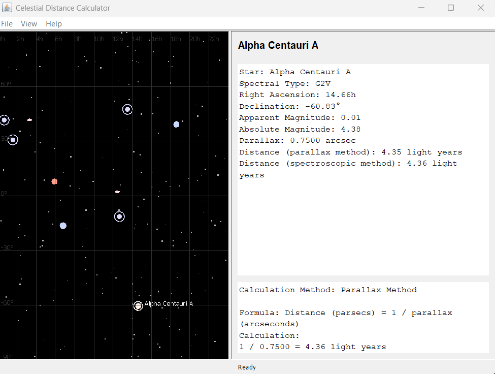

# Celestial Distance Calculator

A little java app to display a small patch of sky with notable celestial objects. For each celestial object selected, a panel with calculated distance and stats will display.

To run:

```
javac com/celestialdistance/CelestialDistanceCalculator.java
java com.celestialdistance.CelestialDistanceCalculator
```


